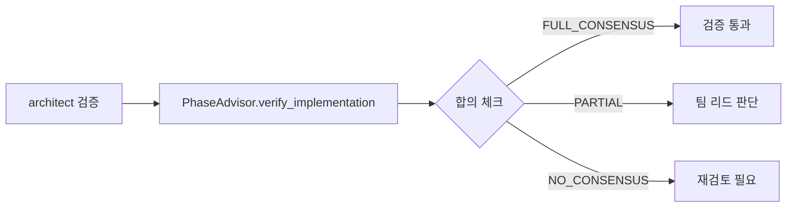

# 설계 문서: Ultimate Debate 워크플로우 전면 수정

**Version**: 1.0.0
**Status**: APPROVED
**Date**: 2026-02-18
**Author**: Designer (Agent Teams)
**Based on**: `C:\claude\ultimate-debate\docs\01-plan\workflow-overhaul.prd.md`

---

## 1. 설계 개요

### 1.1 목표

4개 Phase를 통해 Ultimate Debate 엔진을 실제 API 호출을 보장하는 프로덕션 수준 시스템으로 전환:

| Phase | 목표 | 핵심 변경 |
|:-----:|------|----------|
| A | Mock Fallback 제거 + Strict Mode | Mock 자동 호출 경로 차단, 명시적 에러 발생 |
| B | Preflight Health Check | `run()` 진입 전 클라이언트 건강 확인, 실패 클라이언트 제거 |
| C | 결과 무결성 검증 | API 응답 품질 자동 체크, 짧은/불완전한 분석 필터링 |
| D | auto/SKILL.md 동기화 | PhaseAdvisor를 PDCA Phase 4.2에 공식 통합 |

### 1.2 설계 원칙

1. **TDD 우선**: 모든 Phase는 테스트 작성 후 구현
2. **Graceful Degradation**: strict 모드가 아니면 실패 클라이언트를 경고 로깅 후 제거
3. **API 응답 보존**: 실제 model_version을 `result["model_version"]`에 보존 (등록 키와 분리)
4. **명시적 에러**: 실패 시 사용자가 이해 가능한 에러 메시지 제공

---

## 2. Phase A: Mock Fallback 제거 + Strict Mode

### 2.1 현재 코드 분석

**문제 지점**: `C:\claude\ultimate-debate\src\ultimate_debate\engine.py:273-275`

```python
async def run_parallel_analysis(self) -> dict[str, dict[str, Any]]:
    # ... (외부 AI 병렬 호출)
    # ... (Claude 자체 분석 추가)

    # 3. 클라이언트도 없고 Claude 자체 참여도 없으면 mock
    if not analyses:
        return self._mock_parallel_analysis()  # ← 문제: 무조건 성공하는 mock 반환
```

**위험**: 사용자가 AI를 등록하지 않았는데도 조용히 mock으로 성공, 실제 API 호출 여부 확인 불가.

### 2.2 설계 변경

#### 2.2.1 새 예외 클래스 추가

**파일**: `C:\claude\ultimate-debate\src\ultimate_debate\engine.py` (파일 상단, import 후)

```python
class NoAvailableClientsError(Exception):
    """Raised when no AI clients are available for analysis.

    이 에러는 다음 상황에서 발생합니다:
    - ai_clients가 비어 있고
    - include_claude_self=False이거나 Claude 분석이 설정되지 않음

    해결 방법:
    1. register_ai_client()로 외부 AI(GPT, Gemini)를 등록하거나
    2. include_claude_self=True로 설정하고 set_claude_analysis() 호출
    """
```

#### 2.2.2 `run_parallel_analysis()` 수정

**파일**: `C:\claude\ultimate-debate\src\ultimate_debate\engine.py:273-275`

**변경 전**:
```python
    # 3. 클라이언트도 없고 Claude 자체 참여도 없으면 mock
    if not analyses:
        return self._mock_parallel_analysis()
```

**변경 후**:
```python
    # 3. 클라이언트도 없고 Claude 자체 참여도 없으면 에러
    if not analyses:
        raise NoAvailableClientsError(
            "분석 가능한 AI 클라이언트가 없습니다.\n"
            "해결 방법:\n"
            "1. register_ai_client()로 외부 AI(GPT, Gemini)를 등록하거나\n"
            "2. include_claude_self=True를 설정하고 set_claude_analysis()를 호출하세요."
        )
```

#### 2.2.3 Strict Mode 파라미터 추가

**파일**: `C:\claude\ultimate-debate\src\ultimate_debate\engine.py:45-52`

**변경 전**:
```python
def __init__(
    self,
    task: str,
    task_id: str | None = None,
    max_rounds: int = 5,
    consensus_threshold: float = 0.8,
    include_claude_self: bool = True,
):
```

**변경 후**:
```python
def __init__(
    self,
    task: str,
    task_id: str | None = None,
    max_rounds: int = 5,
    consensus_threshold: float = 0.8,
    include_claude_self: bool = True,
    strict: bool = False,  # ← 추가
):
    """Initialize debate orchestrator.

    Args:
        ...
        strict: Strict 모드. True면 외부 AI가 최소 1개 필수.
            False(기본값)면 include_claude_self=True 시 Claude만으로도 동작.
    """
    ...
    self.strict = strict
```

#### 2.2.4 `run()` 메서드에 strict 검증 추가

**파일**: `C:\claude\ultimate-debate\src\ultimate_debate\engine.py:138-152` (run 메서드 초반)

**삽입 위치**: `self.context_manager.save_task()` 호출 직후

```python
async def run(self) -> dict[str, Any]:
    """Run complete debate workflow."""
    # Save initial task
    self.context_manager.save_task(...)

    # Strict mode: 외부 AI 필수 검증
    if self.strict and not self.ai_clients:
        raise NoAvailableClientsError(
            "Strict 모드: 외부 AI(GPT, Gemini) 최소 1개 등록 필수.\n"
            "register_ai_client()로 외부 AI를 등록하세요."
        )

    while self.round < self.max_rounds:
        ...
```

#### 2.2.5 Mock 메서드 격리 (테스트 전용)

**변경 사항**: 기존 `_mock_*` 메서드는 그대로 유지하되, `run()` 메서드에서는 호출하지 않음.

**유지할 메서드** (engine.py:569-626):
- `_mock_parallel_analysis()`
- `_mock_cross_review()`
- `_mock_debate_round()`

**목적**: `tests/conftest.py`에서 직접 호출 또는 fixture로 제공하여 테스트에서만 사용.

### 2.3 테스트 설계

#### Test 1: `test_run_raises_without_clients`

**파일**: `C:\claude\ultimate-debate\tests\test_engine.py`

```python
@pytest.mark.asyncio
async def test_run_raises_without_clients():
    """Test that run() raises NoAvailableClientsError when no clients available."""
    from ultimate_debate.engine import NoAvailableClientsError

    debate = UltimateDebate(
        task="Test task",
        include_claude_self=False,  # Claude 자체 참여 비활성화
    )
    # 외부 AI 등록 없음

    with pytest.raises(NoAvailableClientsError) as exc_info:
        await debate.run()

    assert "분석 가능한 AI 클라이언트가 없습니다" in str(exc_info.value)
```

#### Test 2: `test_strict_mode_requires_external_ai`

```python
@pytest.mark.asyncio
async def test_strict_mode_requires_external_ai():
    """Test that strict mode requires at least one external AI."""
    from ultimate_debate.engine import NoAvailableClientsError

    debate = UltimateDebate(
        task="Test task",
        include_claude_self=True,  # Claude는 있지만
        strict=True,  # strict 모드는 외부 AI 필수
    )
    debate.set_claude_analysis({
        "analysis": "Test",
        "conclusion": "OK",
        "confidence": 0.9,
    })

    with pytest.raises(NoAvailableClientsError) as exc_info:
        await debate.run()

    assert "Strict 모드" in str(exc_info.value)
    assert "외부 AI" in str(exc_info.value)
```

#### Test 3: `test_mock_methods_not_called_in_run`

```python
@pytest.mark.asyncio
async def test_mock_methods_not_called_in_run():
    """Test that mock methods are never called during normal run()."""
    from unittest.mock import patch
    from ultimate_debate.engine import NoAvailableClientsError

    debate = UltimateDebate(
        task="Test",
        include_claude_self=False,
    )

    with patch.object(debate, '_mock_parallel_analysis') as mock_method:
        with pytest.raises(NoAvailableClientsError):
            await debate.run()

        # Mock 메서드가 호출되지 않았는지 확인
        mock_method.assert_not_called()
```

---

## 3. Phase B: Preflight Health Check

### 3.1 현재 코드 분석

**문제**: `run()` 메서드는 등록된 클라이언트의 인증 상태를 확인하지 않고 바로 분석 시작.

**위험**:
- 토큰 만료된 클라이언트가 분석 중 실패 → 불필요한 재시도
- 네트워크 문제 → 전체 워크플로우 차단

### 3.2 설계 변경

#### 3.2.1 HealthStatus dataclass 추가

**파일**: `C:\claude\ultimate-debate\src\ultimate_debate\workflow\client_pool.py` (파일 상단)

```python
from dataclasses import dataclass
import time

@dataclass
class HealthStatus:
    """Health check result for a single AI client.

    Attributes:
        available: True if client passed health check
        latency_ms: Round-trip latency in milliseconds (0 if unavailable)
        model_version: Discovered model version from health check
        error: Error message if unavailable (empty if available)
    """
    available: bool
    latency_ms: float = 0.0
    model_version: str = ""
    error: str = ""
```

#### 3.2.2 `ClientPool.health_check()` 추가

**파일**: `C:\claude\ultimate-debate\src\ultimate_debate\workflow\client_pool.py`

**삽입 위치**: `available_models` property 직후, `close()` 메서드 전

```python
async def health_check(self, timeout: float = 30.0) -> dict[str, HealthStatus]:
    """Check health of all registered clients.

    Performs lightweight analyze() call to verify:
    - Authentication is valid
    - API is reachable
    - Model is responsive

    Args:
        timeout: Max seconds to wait for each client (default: 30)

    Returns:
        Dict mapping model name to HealthStatus

    Example:
        >>> pool = ClientPool()
        >>> await pool.initialize()
        >>> health = await pool.health_check()
        >>> if health["gpt"].available:
        ...     print(f"GPT latency: {health['gpt'].latency_ms:.0f}ms")
    """
    results = {}

    for model, client in self._clients.items():
        try:
            start = time.monotonic()
            # Lightweight health check: short analyze call
            response = await asyncio.wait_for(
                client.analyze(
                    "health check ping",
                    context={"health_check": True}
                ),
                timeout=timeout
            )
            latency = (time.monotonic() - start) * 1000

            # Extract model version from response
            model_version = response.get(
                "model_version",
                getattr(client, 'discovered_model', client.model_name)
            )

            results[model] = HealthStatus(
                available=True,
                latency_ms=latency,
                model_version=model_version
            )
            logger.info(
                f"✓ {model} health check passed "
                f"({latency:.0f}ms, {model_version})"
            )
        except asyncio.TimeoutError:
            results[model] = HealthStatus(
                available=False,
                error=f"Timeout after {timeout}s"
            )
            logger.warning(f"✗ {model} health check timeout")
        except Exception as e:
            results[model] = HealthStatus(
                available=False,
                error=str(e)
            )
            logger.warning(f"✗ {model} health check failed: {e}")

    return results
```

#### 3.2.3 `engine.run()` Preflight 추가

**파일**: `C:\claude\ultimate-debate\src\ultimate_debate\engine.py`

**삽입 위치**: `run()` 메서드, strict mode 검증 직후

```python
async def run(self) -> dict[str, Any]:
    """Run complete debate workflow."""
    # Save initial task
    self.context_manager.save_task(...)

    # Strict mode: 외부 AI 필수 검증
    if self.strict and not self.ai_clients:
        raise NoAvailableClientsError(...)

    # Preflight: 등록된 외부 AI 클라이언트 건강 확인
    if self.ai_clients:
        logger.info("Preflight: checking client authentication...")
        dead_clients = []

        for model_name, client in list(self.ai_clients.items()):
            try:
                await asyncio.wait_for(
                    client.ensure_authenticated(),
                    timeout=30.0
                )
                logger.info(f"✓ {model_name} preflight passed")
            except asyncio.TimeoutError:
                error_msg = f"Preflight timeout (30s)"
                logger.warning(f"✗ {model_name} {error_msg}")
                self.failed_clients[model_name] = error_msg
                dead_clients.append(model_name)
            except Exception as e:
                error_msg = f"Preflight failed: {e}"
                logger.warning(f"✗ {model_name} {error_msg}")
                self.failed_clients[model_name] = error_msg
                dead_clients.append(model_name)

        # 실패 클라이언트 제거
        for model_name in dead_clients:
            del self.ai_clients[model_name]

        # Strict 모드에서 모든 클라이언트 실패 시 에러
        if self.strict and not self.ai_clients:
            raise NoAvailableClientsError(
                f"Preflight 실패: 모든 외부 AI 사용 불가.\n"
                f"실패 클라이언트: {list(self.failed_clients.keys())}\n"
                f"상세: {self.failed_clients}"
            )

    while self.round < self.max_rounds:
        ...
```

### 3.3 테스트 설계

#### Test 4: `test_health_check_all_healthy`

**파일**: `C:\claude\ultimate-debate\tests\test_workflow\test_client_pool.py`

```python
import pytest
from unittest.mock import AsyncMock
from ultimate_debate.workflow.client_pool import ClientPool, HealthStatus

@pytest.mark.asyncio
async def test_health_check_all_healthy():
    """Test health check when all clients are healthy."""
    pool = ClientPool()

    # Mock clients
    mock_gpt = AsyncMock()
    mock_gpt.analyze.return_value = {
        "analysis": "OK",
        "conclusion": "OK",
        "confidence": 0.9,
        "model_version": "gpt-5.3-codex"
    }
    pool._clients["gpt"] = mock_gpt
    pool._auth_status["gpt"] = True

    mock_gemini = AsyncMock()
    mock_gemini.analyze.return_value = {
        "analysis": "OK",
        "conclusion": "OK",
        "confidence": 0.9,
        "model_version": "gemini-2.5-pro"
    }
    pool._clients["gemini"] = mock_gemini
    pool._auth_status["gemini"] = True

    health = await pool.health_check(timeout=10.0)

    assert len(health) == 2
    assert health["gpt"].available is True
    assert health["gpt"].latency_ms > 0
    assert health["gpt"].model_version == "gpt-5.3-codex"
    assert health["gemini"].available is True
```

#### Test 5: `test_health_check_partial_failure`

```python
@pytest.mark.asyncio
async def test_health_check_partial_failure():
    """Test health check when one client fails."""
    pool = ClientPool()

    mock_gpt = AsyncMock()
    mock_gpt.analyze.return_value = {"analysis": "OK", "conclusion": "OK", "confidence": 0.9}
    pool._clients["gpt"] = mock_gpt
    pool._auth_status["gpt"] = True

    mock_gemini = AsyncMock()
    mock_gemini.analyze.side_effect = ConnectionError("API down")
    pool._clients["gemini"] = mock_gemini
    pool._auth_status["gemini"] = True

    health = await pool.health_check(timeout=10.0)

    assert health["gpt"].available is True
    assert health["gemini"].available is False
    assert "API down" in health["gemini"].error
```

#### Test 6: `test_preflight_removes_dead_clients`

**파일**: `C:\claude\ultimate-debate\tests\test_engine.py`

```python
@pytest.mark.asyncio
async def test_preflight_removes_dead_clients():
    """Test that preflight removes failed clients from ai_clients."""
    from unittest.mock import AsyncMock

    debate = UltimateDebate(
        task="Test",
        include_claude_self=True,
        strict=False,  # non-strict: 실패해도 계속 진행
    )
    debate.set_claude_analysis({
        "analysis": "OK",
        "conclusion": "OK",
        "confidence": 0.9,
    })

    # GPT는 정상, Gemini는 실패
    mock_gpt = AsyncMock()
    mock_gpt.ensure_authenticated.return_value = None
    mock_gpt.analyze.return_value = {
        "analysis": "OK",
        "conclusion": "OK",
        "confidence": 0.9,
    }
    debate.register_ai_client("gpt", mock_gpt)

    mock_gemini = AsyncMock()
    mock_gemini.ensure_authenticated.side_effect = ConnectionError("Auth failed")
    debate.register_ai_client("gemini", mock_gemini)

    # run() 실행 → preflight가 gemini 제거해야 함
    result = await debate.run()

    # Gemini는 failed_clients에 기록되고 ai_clients에서 제거됨
    assert "gemini" in debate.failed_clients
    assert "gemini" not in debate.ai_clients
    assert "gpt" in debate.ai_clients
```

---

## 4. Phase C: 결과 무결성 검증

### 4.1 현재 코드 분석

**문제**: `run_parallel_analysis()`는 API 응답을 그대로 `analyses`에 추가하지만, 응답이 유효한지 검증하지 않음.

**위험**:
- Mock 응답이 섞여도 구분 불가
- 짧은 분석 (예: "OK")도 그대로 합의 체크
- 필수 필드 누락 시 후속 Phase에서 KeyError

### 4.2 설계 변경

#### 4.2.1 `_validate_analysis()` 메서드 추가

**파일**: `C:\claude\ultimate-debate\src\ultimate_debate\engine.py`

**삽입 위치**: `_get_claude_self_analysis()` 메서드 직후

```python
def _validate_analysis(self, model: str, result: dict[str, Any]) -> bool:
    """Validate that analysis result is a genuine API response.

    검증 항목:
    1. 필수 필드 존재 (analysis, conclusion, confidence)
    2. 최소 분석 길이 (50자 이상)
    3. confidence 값 범위 (0.0~1.0)

    Args:
        model: Model name for logging
        result: Analysis result to validate

    Returns:
        True if valid, False if invalid

    Note:
        플레이스홀더 분석 (requires_input=True)도 유효하지 않은 것으로 처리.
    """
    # 플레이스홀더 체크
    if result.get("requires_input"):
        logger.warning(f"{model}: 플레이스홀더 분석 (requires_input=True)")
        return False

    # 필수 필드 검증
    required_fields = ["analysis", "conclusion", "confidence"]
    missing = [f for f in required_fields if f not in result]
    if missing:
        logger.warning(f"{model}: 필수 필드 누락 {missing}")
        return False

    # 최소 분석 길이 검증 (실제 분석은 최소 50자 이상)
    analysis_text = result.get("analysis", "")
    if not isinstance(analysis_text, str) or len(analysis_text) < 50:
        logger.warning(
            f"{model}: 분석이 너무 짧음 ({len(analysis_text)}자). "
            f"최소 50자 이상 필요."
        )
        return False

    # confidence 범위 검증
    confidence = result.get("confidence", 0)
    if not isinstance(confidence, (int, float)):
        logger.warning(f"{model}: confidence가 숫자가 아님 ({type(confidence)})")
        return False
    if not (0 <= confidence <= 1):
        logger.warning(f"{model}: confidence 범위 초과 ({confidence})")
        return False

    return True
```

#### 4.2.2 `run_parallel_analysis()` 수정

**파일**: `C:\claude\ultimate-debate\src\ultimate_debate\engine.py:250-265`

**변경 전**:
```python
for model_name, result in zip(model_names, results, strict=True):
    # 개별 클라이언트 실패 시 graceful skip
    if isinstance(result, Exception):
        logger.warning(f"{model_name} analysis failed: {result}")
        self.failed_clients[model_name] = str(result)
        continue

    # API 응답의 정확한 모델 버전 보존 (존재 시)
    if "model_version" not in result:
        result["model_version"] = result.get("model", model_name)
    result["model"] = model_name  # 등록 키 (파일명용)
    analyses[model_name] = result

    # Save to context
    self.context_manager.save_round(self.round, model_name, result)
```

**변경 후**:
```python
for model_name, result in zip(model_names, results, strict=True):
    # 개별 클라이언트 실패 시 graceful skip
    if isinstance(result, Exception):
        logger.warning(f"{model_name} analysis failed: {result}")
        self.failed_clients[model_name] = str(result)
        continue

    # 결과 무결성 검증
    if not self._validate_analysis(model_name, result):
        error_msg = "분석 결과 무결성 검증 실패"
        logger.warning(f"{model_name}: {error_msg}")
        self.failed_clients[model_name] = error_msg
        continue

    # API 응답의 정확한 모델 버전 보존 (존재 시)
    if "model_version" not in result:
        result["model_version"] = result.get("model", model_name)
    result["model"] = model_name  # 등록 키 (파일명용)
    analyses[model_name] = result

    # Save to context
    self.context_manager.save_round(self.round, model_name, result)
```

#### 4.2.3 Claude 자체 분석도 검증 추가

**파일**: `C:\claude\ultimate-debate\src\ultimate_debate\engine.py:268-271`

**변경 후**:
```python
# 2. Claude Code 자체 분석 추가 (API 호출 없음)
if self.include_claude_self:
    claude_analysis = self._get_claude_self_analysis()

    # Claude 분석도 검증 (플레이스홀더 필터링)
    if self._validate_analysis("claude", claude_analysis):
        analyses["claude"] = claude_analysis
        self.context_manager.save_round(self.round, "claude", claude_analysis)
    else:
        logger.warning("Claude 자체 분석이 유효하지 않음 (set_claude_analysis() 호출 필요)")
        self.failed_clients["claude"] = "플레이스홀더 분석 (set_claude_analysis() 미호출)"
```

### 4.3 테스트 설계

#### Test 7: `test_validate_analysis_rejects_short`

**파일**: `C:\claude\ultimate-debate\tests\test_engine.py`

```python
def test_validate_analysis_rejects_short():
    """Test that _validate_analysis rejects short analysis."""
    debate = UltimateDebate(task="Test")

    # 짧은 분석 (50자 미만)
    result = {
        "analysis": "OK",
        "conclusion": "APPROVE",
        "confidence": 0.9,
    }

    assert debate._validate_analysis("test", result) is False

    # 충분한 길이의 분석
    result2 = {
        "analysis": "This is a detailed analysis with more than fifty characters to pass validation.",
        "conclusion": "APPROVE",
        "confidence": 0.9,
    }

    assert debate._validate_analysis("test", result2) is True
```

#### Test 8: `test_validate_analysis_rejects_missing_fields`

```python
def test_validate_analysis_rejects_missing_fields():
    """Test that _validate_analysis rejects missing required fields."""
    debate = UltimateDebate(task="Test")

    # conclusion 누락
    result = {
        "analysis": "A" * 100,
        "confidence": 0.9,
    }
    assert debate._validate_analysis("test", result) is False

    # confidence 누락
    result2 = {
        "analysis": "A" * 100,
        "conclusion": "APPROVE",
    }
    assert debate._validate_analysis("test", result2) is False

    # confidence 범위 초과
    result3 = {
        "analysis": "A" * 100,
        "conclusion": "APPROVE",
        "confidence": 1.5,
    }
    assert debate._validate_analysis("test", result3) is False
```

#### Test 9: `test_validate_analysis_rejects_placeholder`

```python
def test_validate_analysis_rejects_placeholder():
    """Test that _validate_analysis rejects placeholder analysis."""
    debate = UltimateDebate(task="Test")

    # requires_input=True 플래그
    result = {
        "analysis": "A" * 100,
        "conclusion": "APPROVE",
        "confidence": 0.9,
        "requires_input": True,
    }

    assert debate._validate_analysis("test", result) is False
```

#### Test 10: `test_run_parallel_analysis_filters_invalid`

```python
@pytest.mark.asyncio
async def test_run_parallel_analysis_filters_invalid():
    """Test that invalid analysis results are filtered out."""
    from unittest.mock import AsyncMock

    debate = UltimateDebate(
        task="Test",
        include_claude_self=False,
    )

    # GPT는 유효, Gemini는 무효 (짧은 분석)
    mock_gpt = AsyncMock()
    mock_gpt.analyze.return_value = {
        "analysis": "This is a detailed GPT analysis with sufficient length to pass validation checks.",
        "conclusion": "APPROVE",
        "confidence": 0.9,
    }
    debate.register_ai_client("gpt", mock_gpt)

    mock_gemini = AsyncMock()
    mock_gemini.analyze.return_value = {
        "analysis": "OK",  # 너무 짧음
        "conclusion": "APPROVE",
        "confidence": 0.9,
    }
    debate.register_ai_client("gemini", mock_gemini)

    analyses = await debate.run_parallel_analysis()

    # GPT만 포함, Gemini는 제외
    assert "gpt" in analyses
    assert "gemini" not in analyses
    assert "gemini" in debate.failed_clients
    assert "무결성 검증 실패" in debate.failed_clients["gemini"]
```

---

## 5. Phase D: auto/SKILL.md 동기화

### 5.1 현재 상태 분석

**문제**:
- `workflow/phase_advisor.py`는 완성됨 (Phase 1.0, 1.2, 4.2, 5)
- `.claude/skills/auto/SKILL.md`에는 PhaseAdvisor 호출 지시 없음
- REFERENCE.md도 부분적으로만 업데이트됨

### 5.2 설계 변경

#### 5.2.1 SKILL.md Phase 4.2 수정

**파일**: `C:\claude\.claude\skills\auto\SKILL.md`

**변경 섹션**: **Step 4.2: 검증 (Verification)** (Phase 4)

**변경 전** (현재):
```markdown
**Step 4.2**: 검증 (Verification)

| 모드 | 검증 방법 |
|------|----------|
| LIGHT | architect (sonnet) 1회 검증 |
| STANDARD | architect → gap-detector 2단계 검증 |
| HEAVY | architect → gap-detector → code-analyzer 3단계 검증 |
```

**변경 후**:
```markdown
**Step 4.2**: 검증 (Verification)

| 모드 | 검증 방법 | 3AI 다관점 검증 |
|------|----------|----------------|
| LIGHT | architect (sonnet) 1회 검증 | 없음 |
| STANDARD | architect → gap-detector 2단계 검증 | **PhaseAdvisor.verify_implementation()** (GPT+Gemini+Claude) |
| HEAVY | architect → gap-detector → code-analyzer 3단계 검증 | **PhaseAdvisor.verify_implementation()** (GPT+Gemini+Claude) |

#### STANDARD/HEAVY 모드 3AI 검증 절차

**Step 4.2.1**: architect 검증 (기존)

**Step 4.2.2**: 3AI 다관점 검증 (신규)

```python
from ultimate_debate.workflow import ClientPool, PhaseAdvisor

# ClientPool 초기화
pool = ClientPool()
await pool.initialize()  # GPT + Gemini 자동 인증
advisor = PhaseAdvisor(pool)

# 3AI 검증 (Claude + GPT + Gemini)
verification = await advisor.verify_implementation(
    task=task_description,
    code_summary=implementation_summary,
    claude_verdict=architect_result  # architect 검증 결과
)

await pool.close()

# 결과 해석
if verification["status"] == "FULL_CONSENSUS":
    print(f"✓ 3AI 합의 검증 통과 ({verification['consensus_percentage']*100:.0f}%)")
    print(f"합의 항목: {verification['agreed_items']}")
elif verification["status"] == "PARTIAL_CONSENSUS":
    print(f"△ 부분 합의 ({verification['consensus_percentage']*100:.0f}%)")
    print(f"불일치 항목: {verification['disputed_items']}")
    # 팀 리드에게 판단 요청
else:
    print(f"✗ 합의 실패 - 재검토 필요")
    # 불일치 항목 분석 후 재구현 또는 팀 리드 판단
```

**Step 4.2.3**: gap-detector / code-analyzer (기존)
```

#### 5.2.2 REFERENCE.md 업데이트

**파일**: `C:\claude\.claude\skills\auto\REFERENCE.md`

**추가 섹션**: **Phase 4.2 — 3AI 다관점 검증** (기존 Phase 4 섹션 확장)

```markdown
### Phase 4.2 — 3AI 다관점 검증 (STANDARD/HEAVY)

**목적**: Claude Code(architect) 검증 결과를 GPT + Gemini와 교차 검증하여 편향 방지.

**투입 LLM**:
- Claude Code (architect): 초기 검증
- GPT-5 Codex: 실용성 관점
- Gemini 2.5 Pro: 안정성/확장성 관점

**워크플로우**:



**코드 예시**:

```python
from ultimate_debate.workflow import ClientPool, PhaseAdvisor

async def phase_4_2_verification(
    task: str,
    implementation_summary: str,
    architect_verdict: dict
):
    """Phase 4.2 3AI 검증 실행.

    Args:
        task: 구현 태스크 설명
        implementation_summary: 구현 요약 (파일 목록, 핵심 변경 사항)
        architect_verdict: architect 검증 결과 (APPROVE/REJECT + 피드백)

    Returns:
        verification: 3AI 합의 결과
            - status: FULL_CONSENSUS / PARTIAL_CONSENSUS / NO_CONSENSUS
            - consensus_percentage: 0.0~1.0
            - agreed_items: 합의된 항목 리스트
            - disputed_items: 불일치 항목 리스트
    """
    pool = ClientPool()

    try:
        await pool.initialize()  # GPT + Gemini 자동 인증

        if not pool.available_models:
            logger.warning("외부 AI 사용 불가 - architect 검증만 사용")
            return {
                "status": "FALLBACK",
                "consensus_percentage": 1.0,
                "agreed_items": [architect_verdict],
                "disputed_items": [],
            }

        advisor = PhaseAdvisor(pool)

        verification = await advisor.verify_implementation(
            task=task,
            code_summary=implementation_summary,
            claude_verdict=architect_verdict
        )

        logger.info(
            f"3AI 검증 완료: {verification['status']} "
            f"({verification['consensus_percentage']*100:.0f}%)"
        )

        return verification
    finally:
        await pool.close()

# 사용 예시
verification = await phase_4_2_verification(
    task="ClientPool에 health_check() 추가",
    implementation_summary=(
        "파일: src/ultimate_debate/workflow/client_pool.py\n"
        "변경: health_check() 메서드 추가 (30줄)\n"
        "테스트: tests/test_workflow/test_client_pool.py (2개 테스트)"
    ),
    architect_verdict={
        "verdict": "APPROVE",
        "feedback": "구현 양호, 테스트 충분",
        "confidence": 0.9,
    }
)

if verification["status"] == "FULL_CONSENSUS":
    print("✓ 검증 통과")
elif verification["status"] == "PARTIAL_CONSENSUS":
    print(f"△ 부분 합의 ({verification['consensus_percentage']*100:.0f}%)")
    print(f"불일치: {verification['disputed_items']}")
    # 팀 리드에게 판단 요청
else:
    print("✗ 재검토 필요")
```

**Graceful Degradation**:
- GPT/Gemini 인증 실패 시 → architect 검증만 사용 (경고 로깅)
- ClientPool.initialize() 실패 시 → status="FALLBACK"
```

### 5.3 테스트 설계

**테스트 없음** (문서 수정이므로 manual review만 수행)

**검증 방법**:
1. SKILL.md 변경 후 `/auto` 스킬 실행하여 Phase 4.2에서 PhaseAdvisor 호출 확인
2. REFERENCE.md 예시 코드 복사-붙여넣기로 실행 가능한지 검증

---

## 6. 구현 순서 및 체크리스트

### 6.1 Phase A: Mock Fallback 제거 + Strict Mode

- [ ] `NoAvailableClientsError` 예외 클래스 추가 (engine.py 상단)
- [ ] `run_parallel_analysis()` 수정 (L273-275): mock 호출 → 예외 발생
- [ ] `__init__()` 수정: `strict` 파라미터 추가
- [ ] `run()` 수정: strict mode 검증 로직 추가
- [ ] **TDD**: `test_run_raises_without_clients` 작성 → 구현 → 통과
- [ ] **TDD**: `test_strict_mode_requires_external_ai` 작성 → 구현 → 통과
- [ ] **TDD**: `test_mock_methods_not_called_in_run` 작성 → 구현 → 통과

### 6.2 Phase B: Preflight Health Check

- [ ] `HealthStatus` dataclass 추가 (client_pool.py)
- [ ] `ClientPool.health_check()` 메서드 추가
- [ ] `engine.run()` 수정: preflight 로직 추가
- [ ] **TDD**: `test_health_check_all_healthy` 작성 → 구현 → 통과
- [ ] **TDD**: `test_health_check_partial_failure` 작성 → 구현 → 통과
- [ ] **TDD**: `test_preflight_removes_dead_clients` 작성 → 구현 → 통과

### 6.3 Phase C: 결과 무결성 검증

- [ ] `_validate_analysis()` 메서드 추가 (engine.py)
- [ ] `run_parallel_analysis()` 수정: 외부 AI 결과 검증 추가
- [ ] `run_parallel_analysis()` 수정: Claude 자체 분석 검증 추가
- [ ] **TDD**: `test_validate_analysis_rejects_short` 작성 → 구현 → 통과
- [ ] **TDD**: `test_validate_analysis_rejects_missing_fields` 작성 → 구현 → 통과
- [ ] **TDD**: `test_validate_analysis_rejects_placeholder` 작성 → 구현 → 통과
- [ ] **TDD**: `test_run_parallel_analysis_filters_invalid` 작성 → 구현 → 통과

### 6.4 Phase D: auto/SKILL.md 동기화

- [ ] `.claude/skills/auto/SKILL.md` 수정: Phase 4.2 섹션 교체
- [ ] `.claude/skills/auto/REFERENCE.md` 수정: 3AI 검증 섹션 추가
- [ ] 수동 검증: `/auto` 스킬로 Phase 4.2 실행 시 PhaseAdvisor 호출 확인

### 6.5 최종 검증

- [ ] 전체 테스트 실행: `pytest tests/test_engine.py -v`
- [ ] E2E 테스트 추가: `tests/test_workflow/test_e2e_real_api.py`
  - Test 8: Preflight health check (실제 GPT/Gemini API)
  - Test 9: Strict mode + 실제 API 호출
- [ ] 린트: `ruff check src/ --fix`
- [ ] 커밋: Conventional Commit 형식

---

## 7. 파일별 변경 요약

| 파일 | Phase | 변경 유형 | 변경량 |
|------|:-----:|----------|:------:|
| `src/ultimate_debate/engine.py` | A, B, C | 수정 | +120줄 |
| `src/ultimate_debate/workflow/client_pool.py` | B | 수정 | +60줄 |
| `tests/test_engine.py` | A, B, C | 수정 | +180줄 |
| `tests/test_workflow/test_client_pool.py` | B | 수정 | +60줄 |
| `tests/test_workflow/test_e2e_real_api.py` | B | 수정 | +40줄 |
| `.claude/skills/auto/SKILL.md` | D | 수정 | +30줄 |
| `.claude/skills/auto/REFERENCE.md` | D | 수정 | +80줄 |
| **총계** | - | - | **+570줄** |

---

## 8. 위험 요소 및 대응

| 위험 | 확률 | 영향 | 대응 |
|------|:----:|:----:|------|
| Phase A 적용 시 기존 테스트 깨짐 | 높음 | 중간 | `include_claude_self=False` 테스트에 mock fixture 제공 |
| Preflight timeout으로 정상 클라이언트 제거 | 낮음 | 높음 | timeout 30초 충분히 길게, 재인증 로직 강화 |
| `_validate_analysis()` 50자 기준이 너무 엄격 | 중간 | 중간 | 실제 API 응답 길이 통계 수집 후 조정 |
| auto/SKILL.md 수정 시 다른 Phase 영향 | 낮음 | 높음 | Phase 4.2만 독립적으로 수정, 전체 Phase 1-5 테스트 |

---

## 9. 성공 기준

| 기준 | 측정 방법 |
|------|----------|
| Mock fallback이 `run()`에서 절대 호출되지 않음 | `test_mock_methods_not_called_in_run` 통과 |
| 실제 API 미등록 시 명확한 에러 발생 | `test_run_raises_without_clients` 통과 |
| Preflight에서 실패한 클라이언트 자동 제거 | `test_preflight_removes_dead_clients` 통과 |
| 분석 결과 50자 미만이면 거부 | `test_validate_analysis_rejects_short` 통과 |
| auto/SKILL.md가 실제 코드와 100% 동기화 | Phase 4.2에서 PhaseAdvisor 호출 확인 (수동) |
| 전체 테스트 통과 | `pytest tests/ -v --cov` 성공 (120초 제한) |

---

## 10. 참조 문서

| 문서 | 용도 |
|------|------|
| `C:\claude\ultimate-debate\docs\01-plan\workflow-overhaul.prd.md` | 요구사항 정의 |
| `C:\claude\ultimate-debate\src\ultimate_debate\engine.py` | 현재 엔진 코드 |
| `C:\claude\ultimate-debate\src\ultimate_debate\workflow\client_pool.py` | ClientPool 현재 코드 |
| `C:\claude\ultimate-debate\tests\test_engine.py` | 현재 테스트 |
| `.claude/skills/auto/SKILL.md` | auto 스킬 지시 문서 |
| `.claude/skills/auto/REFERENCE.md` | auto 스킬 참조 문서 |

---

**설계 승인**: Designer (Agent Teams)
**다음 단계**: 팀 리드가 impl-manager에게 구현 위임
