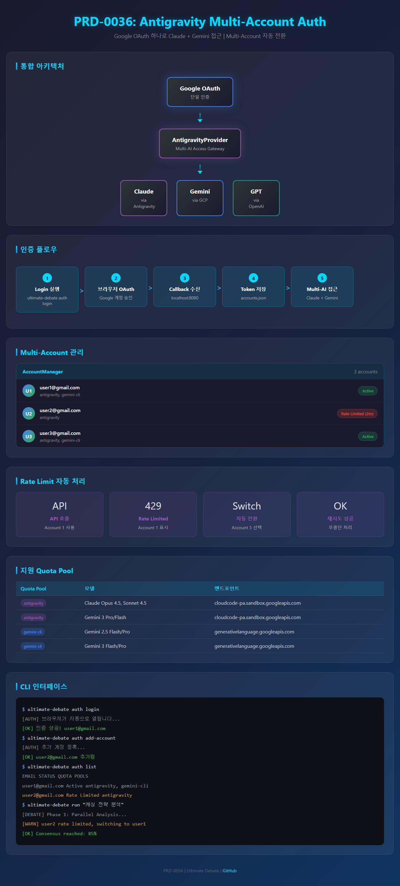

# PRD-0036: Antigravity Multi-Account 인증 시스템

**Version**: 1.0.0
**Status**: Draft
**Created**: 2026-01-20
**Author**: Claude Opus 4.5

---

## 1. 개요

### 1.1 배경

Ultimate Debate는 여러 AI 모델(Claude, GPT, Gemini) 간의 토론을 통해 합의를 도출하는 Multi-AI Consensus Engine입니다. 현재 각 AI 서비스별로 개별 인증이 필요하며, Rate Limit 발생 시 수동 대응이 필요합니다.

OpenCode의 Antigravity 플러그인 방식을 참고하여, **하나의 Google OAuth로 Claude와 Gemini 모두 접근**할 수 있는 통합 인증 시스템을 구현합니다.

### 1.2 목표

| 목표 | 설명 |
|------|------|
| **단일 OAuth로 Multi-AI 접근** | Google OAuth 하나로 Claude, Gemini 접근 |
| **Multi-Account 지원** | 여러 계정 등록 및 자동 전환 |
| **Rate Limit 자동 처리** | 계정별 quota 추적 및 로테이션 |
| **API 키 제로 정책 유지** | Browser OAuth만 사용, API 키 절대 금지 |

### 1.3 비목표

- Poe, Perplexity 등 기타 AI 서비스 통합
- 기업용 SSO 지원
- 토큰 공유/이전 기능

---

## 2. 현재 상태 분석

### 2.1 기존 아키텍처

```
┌─────────────────────────────────────────────────────────┐
│                    Ultimate Debate                       │
├─────────────────────────────────────────────────────────┤
│  auth/                                                   │
│  ├── providers/                                          │
│  │   ├── base.py          # AuthToken, BaseProvider     │
│  │   ├── openai_provider.py  # Device Code Flow         │
│  │   └── google_provider.py  # Browser OAuth            │
│  ├── flows/                                             │
│  │   ├── browser_oauth.py    # PKCE OAuth               │
│  │   └── device_code.py      # RFC 8628                 │
│  └── storage/                                           │
│      └── token_store.py      # keyring + file fallback  │
└─────────────────────────────────────────────────────────┘
```

### 2.2 현재 문제점

| 문제 | 영향 |
|------|------|
| **개별 인증 필요** | OpenAI, Google 각각 로그인해야 함 |
| **단일 계정** | Rate Limit 시 대기 필요 |
| **수동 갱신** | 토큰 만료 시 수동 재로그인 |
| **Claude 미지원** | Anthropic 직접 OAuth 미지원 |

---

## 3. 제안 아키텍처

### 3.1 Antigravity 통합 방식

```
┌───────────────────────────────────────────────────────────────┐
│                    Google OAuth (단일 인증)                    │
└───────────────────────────────────────────────────────────────┘
                              │
                              ▼
        ┌─────────────────────────────────────────┐
        │         AntigravityProvider              │
        │  (Google OAuth → Multi-AI Access)        │
        └─────────────────────────────────────────┘
                              │
              ┌───────────────┼───────────────┐
              ▼               ▼               ▼
        ┌──────────┐    ┌──────────┐    ┌──────────┐
        │ Gemini   │    │ Claude   │    │  GPT     │
        │ via GCP  │    │ via AG   │    │ via OAI  │
        └──────────┘    └──────────┘    └──────────┘
```

### 3.2 Multi-Account 구조

```
┌─────────────────────────────────────────────────────────────┐
│                    AccountManager                            │
├─────────────────────────────────────────────────────────────┤
│  accounts: List[Account]                                     │
│  ├── Account 1 (user1@gmail.com)                            │
│  │   ├── refresh_token: "..."                               │
│  │   ├── rate_limit_until: null (or ISO 8601 with Z)        │
│  │   └── quota_pools: ["antigravity", "gemini-cli"]         │
│  ├── Account 2 (user2@gmail.com)                            │
│  │   ├── refresh_token: "..."                               │
│  │   ├── rate_limit_until: "2026-01-20T12:00:00Z"          │
│  │   └── quota_pools: ["antigravity"]                       │
│  └── ...                                                    │
├─────────────────────────────────────────────────────────────┤
│  Methods:                                                    │
│  ├── add_account(email, refresh_token)                      │
│  ├── remove_account(email)                                  │
│  ├── get_available_account() → Account | None               │
│  ├── mark_rate_limited(email, until)                        │
│  └── clear_expired_rate_limits()                            │
└─────────────────────────────────────────────────────────────┘
```

### 3.3 Rate Limit 자동 처리 흐름

```
┌──────────────────────────────────────────────────────────────────┐
│                     API 호출 시 흐름                             │
└──────────────────────────────────────────────────────────────────┘

    API 호출 요청
         │
         ▼
    ┌─────────────────────┐
    │ get_available_      │
    │ account()           │
    └─────────────────────┘
         │
         ▼
    ┌─────────────────────┐     ┌─────────────────────┐
    │ Rate Limited?       │─Yes→│ 다음 계정으로 전환   │
    └─────────────────────┘     └─────────────────────┘
         │No                            │
         ▼                              │
    ┌─────────────────────┐             │
    │ API 호출 실행       │◄────────────┘
    └─────────────────────┘
         │
         ▼
    ┌─────────────────────┐     ┌─────────────────────┐
    │ 429 응답?           │─Yes→│ mark_rate_limited() │
    └─────────────────────┘     │ + 재시도             │
         │No                    └─────────────────────┘
         ▼
    ┌─────────────────────┐
    │ 성공 반환           │
    └─────────────────────┘
```

---

## 4. 상세 설계

### 4.1 파일 구조

```
src/ultimate_debate/auth/
├── __init__.py                    # 기존 + 새 export 추가
├── providers/
│   ├── base.py                    # 기존 유지
│   ├── openai_provider.py         # 기존 유지
│   ├── google_provider.py         # 기존 유지
│   └── antigravity_provider.py    # [NEW] Antigravity Provider
├── flows/
│   ├── browser_oauth.py           # 기존 유지
│   └── device_code.py             # 기존 유지
├── storage/
│   ├── token_store.py             # 기존 유지
│   └── account_manager.py         # [NEW] Multi-Account 관리
└── models/
    └── account.py                 # [NEW] Account 데이터 모델
```

### 4.2 데이터 모델

#### Account 모델

```python
@dataclass
class Account:
    """Multi-Account 데이터 모델"""

    email: str
    refresh_token: str
    project_id: str | None = None
    quota_pools: list[str] = field(default_factory=lambda: ["antigravity"])
    rate_limit_until: datetime | None = None
    created_at: datetime = field(default_factory=datetime.now)
    last_used_at: datetime | None = None

    def is_rate_limited(self) -> bool:
        """Rate limit 상태 확인"""
        if self.rate_limit_until is None:
            return False
        return datetime.now() < self.rate_limit_until

    def to_dict(self) -> dict:
        """JSON 직렬화용"""
        ...

    @classmethod
    def from_dict(cls, data: dict) -> "Account":
        """JSON 역직렬화용"""
        ...
```

### 4.3 AccountManager

```python
class AccountManager:
    """Multi-Account 관리자

    여러 Google 계정을 관리하고 Rate Limit 시 자동 전환합니다.

    저장 위치:
    - Windows: %APPDATA%/claude-code/ai-auth/accounts.json
    - macOS: ~/Library/Application Support/claude-code/ai-auth/accounts.json
    - Linux: ~/.config/claude-code/ai-auth/accounts.json
    """

    def __init__(self, storage_path: Path | None = None):
        ...

    async def add_account(self, email: str, refresh_token: str,
                          project_id: str | None = None) -> Account:
        """새 계정 추가"""
        ...

    async def remove_account(self, email: str) -> bool:
        """계정 삭제"""
        ...

    def get_available_account(self) -> Account | None:
        """사용 가능한 계정 반환 (Rate Limit 아닌 계정 중 우선)"""
        ...

    def mark_rate_limited(self, email: str,
                          duration_seconds: int = 60) -> None:
        """계정을 Rate Limited 상태로 표시"""
        ...

    def clear_expired_rate_limits(self) -> int:
        """만료된 Rate Limit 해제, 해제된 수 반환"""
        ...

    async def list_accounts(self) -> list[Account]:
        """모든 계정 목록"""
        ...
```

### 4.4 AntigravityProvider

```python
class AntigravityProvider(BaseProvider):
    """Antigravity 통합 Provider

    Google OAuth 하나로 Claude + Gemini 접근.
    OpenCode의 Antigravity 플러그인과 호환.

    지원 Quota Pool:
    - antigravity: Claude Opus 4.5, Sonnet 4.5, Gemini 3
    - gemini-cli: Gemini 2.5 Flash/Pro, Gemini 3

    Example:
        provider = AntigravityProvider()
        await provider.login()  # 첫 번째 계정 추가

        # Multi-Account
        await provider.add_account()  # 추가 계정

        # API 호출 (자동 계정 전환)
        response = await provider.call_claude("분석해줘")
    """

    # Google OAuth 설정 (Antigravity 호환)
    AUTHORIZATION_ENDPOINT = "https://accounts.google.com/o/oauth2/v2/auth"
    TOKEN_ENDPOINT = "https://oauth2.googleapis.com/token"

    # Gemini CLI 공개 Client ID
    CLIENT_ID = "681255809395-oo8ft2oprdrnp9e3aqf6av3hmdib135j.apps.googleusercontent.com"
    CLIENT_SECRET = "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"

    # 스코프: Cloud Platform + OpenID
    SCOPE = "https://www.googleapis.com/auth/cloud-platform openid email"

    def __init__(self):
        self.account_manager = AccountManager()

    @property
    def name(self) -> str:
        return "antigravity"

    @property
    def display_name(self) -> str:
        return "Antigravity (Claude + Gemini)"

    async def login(self, **kwargs) -> AuthToken:
        """새 계정 추가 (Browser OAuth)"""
        ...

    async def add_account(self) -> Account:
        """추가 계정 등록"""
        ...

    async def call_api(self, model: str, messages: list,
                       **kwargs) -> dict:
        """API 호출 (자동 계정 전환)

        Rate Limit 발생 시 자동으로 다음 계정 사용.
        모든 계정이 Rate Limited면 예외 발생.
        """
        ...

    async def call_claude(self, prompt: str, model: str = "claude-opus-4-5",
                          **kwargs) -> str:
        """Claude API 호출 (Antigravity 경로)"""
        ...

    async def call_gemini(self, prompt: str, model: str = "gemini-2.5-flash",
                          **kwargs) -> str:
        """Gemini API 호출"""
        ...
```

---

## 5. API 엔드포인트

### 5.1 Antigravity Quota Pool

| Quota Pool | 모델 | 엔드포인트 |
|------------|------|-----------|
| antigravity | Claude Opus 4.5 | `cloudcode-pa.sandbox.googleapis.com` |
| antigravity | Claude Sonnet 4.5 | `cloudcode-pa.sandbox.googleapis.com` |
| antigravity | Gemini 3 Pro/Flash | `cloudcode-pa.sandbox.googleapis.com` |
| gemini-cli | Gemini 2.5 Flash/Pro | `generativelanguage.googleapis.com` |
| gemini-cli | Gemini 3 Flash/Pro | `generativelanguage.googleapis.com` |

### 5.2 요청 형식

#### Claude via Antigravity

> **Note**: 이 엔드포인트는 OpenCode Antigravity 플러그인 기반이며, Google 정책에 따라 변경될 수 있습니다.

```http
POST https://cloudcode-pa.sandbox.googleapis.com/v1/projects/{project_id}/locations/us-central1/publishers/anthropic/models/{model}:generateContent
Authorization: Bearer {access_token}
Content-Type: application/json

{
  "contents": [
    {"role": "user", "parts": [{"text": "Hello"}]}
  ],
  "generationConfig": {
    "maxOutputTokens": 8192,
    "temperature": 0.7
  }
}
```

#### Gemini via GCP

```http
POST https://generativelanguage.googleapis.com/v1beta/models/{model}:generateContent
Authorization: Bearer {access_token}
Content-Type: application/json

{
  "contents": [
    {"role": "user", "parts": [{"text": "Hello"}]}
  ]
}
```

---

## 6. 토큰 저장 구조

### 6.1 accounts.json 스키마

```json
{
  "version": "1.0.0",
  "accounts": [
    {
      "email": "user1@gmail.com",
      "refresh_token": "1//...",
      "project_id": "project-123",
      "quota_pools": ["antigravity", "gemini-cli"],
      "rate_limit_until": null,
      "created_at": "2026-01-20T10:00:00Z",
      "last_used_at": "2026-01-20T11:00:00Z"
    },
    {
      "email": "user2@gmail.com",
      "refresh_token": "1//...",
      "project_id": null,
      "quota_pools": ["antigravity"],
      "rate_limit_until": "2026-01-20T12:00:00Z",
      "created_at": "2026-01-20T09:00:00Z",
      "last_used_at": "2026-01-20T11:30:00Z"
    }
  ]
}
```

### 6.2 저장 위치

| OS | 경로 |
|----|------|
| Windows | `%APPDATA%\claude-code\ai-auth\accounts.json` |
| macOS | `~/Library/Application Support/claude-code/ai-auth/accounts.json` |
| Linux | `~/.config/claude-code/ai-auth/accounts.json` |

---

## 7. CLI 인터페이스

### 7.1 계정 관리 명령어

```bash
# 첫 계정 추가 (브라우저 OAuth)
ultimate-debate auth login

# 추가 계정 등록
ultimate-debate auth add-account

# 계정 목록 확인
ultimate-debate auth list
# 출력:
#   EMAIL                 STATUS        QUOTA POOLS
#   user1@gmail.com       Active        antigravity, gemini-cli
#   user2@gmail.com       Rate Limited  antigravity

# 계정 삭제
ultimate-debate auth remove user1@gmail.com

# 모든 계정 상태 초기화
ultimate-debate auth reset-limits
```

### 7.2 토론 실행

```bash
# 기본 실행 (자동 계정 전환)
ultimate-debate run "캐싱 전략 분석"

# 특정 계정 사용
ultimate-debate run "캐싱 전략 분석" --account user1@gmail.com

# Rate Limit 시 자동 전환 비활성화
ultimate-debate run "캐싱 전략 분석" --no-auto-switch
```

---

## 8. Manual Fallback 지원

### 8.1 SSH/WSL/Headless 환경

localhost 콜백이 불가능한 환경에서는 Manual URL Paste 모드 제공:

```
┌──────────────────────────────────────────────────────────────┐
│  [AUTH] Manual OAuth Login                                    │
│                                                               │
│  1. 아래 URL을 브라우저에서 엽니다                           │
│  2. 로그인을 완료합니다                                       │
│  3. 리디렉션된 URL (에러 페이지 포함)을 복사합니다           │
│  4. 복사한 URL을 아래에 붙여넣습니다                         │
│                                                               │
│  인증 URL:                                                    │
│  https://accounts.google.com/o/oauth2/v2/auth?...             │
│                                                               │
│  리디렉션된 URL을 붙여넣으세요:                              │
│  > _                                                          │
└──────────────────────────────────────────────────────────────┘
```

---

## 9. 구현 계획

### Phase 1: Account 데이터 모델 (1일)

| 작업 | 파일 |
|------|------|
| Account dataclass 정의 | `auth/models/account.py` |
| 직렬화/역직렬화 구현 | `auth/models/account.py` |
| 단위 테스트 | `tests/test_auth/test_account.py` |

### Phase 2: AccountManager (2일)

| 작업 | 파일 |
|------|------|
| AccountManager 클래스 | `auth/storage/account_manager.py` |
| 파일 기반 저장 | `auth/storage/account_manager.py` |
| Rate Limit 추적 로직 | `auth/storage/account_manager.py` |
| 단위 테스트 | `tests/test_auth/test_account_manager.py` |

### Phase 3: AntigravityProvider (2일)

| 작업 | 파일 |
|------|------|
| Provider 기본 구조 | `auth/providers/antigravity_provider.py` |
| Google OAuth 연동 | `auth/providers/antigravity_provider.py` |
| Claude/Gemini API 호출 | `auth/providers/antigravity_provider.py` |
| 자동 계정 전환 | `auth/providers/antigravity_provider.py` |
| 통합 테스트 | `tests/test_auth/test_antigravity.py` |

### Phase 4: CLI 및 통합 (1일)

| 작업 | 파일 |
|------|------|
| CLI 명령어 추가 | `cli/auth_commands.py` |
| engine.py 연동 | `engine.py` |
| E2E 테스트 | `tests/test_e2e/test_auth_flow.py` |

---

## 10. 성공 기준

| 기준 | 측정 방법 |
|------|----------|
| 단일 OAuth로 Claude + Gemini 접근 | Google 로그인 1회로 두 서비스 모두 동작 |
| Multi-Account 작동 | 3개 이상 계정 등록 및 전환 테스트 |
| Rate Limit 자동 처리 | 429 응답 시 자동 계정 전환 확인 |
| Fallback 지원 | Manual URL Paste 모드 동작 확인 |
| 보안 | keyring 저장, refresh_token 노출 없음 |

---

## 11. 리스크 및 대응

| 리스크 | 확률 | 영향 | 대응 |
|--------|------|------|------|
| Google OAuth 정책 변경 | 중 | 높음 | Client ID 교체 가능하도록 설계 |
| Antigravity 엔드포인트 변경 | 중 | 높음 | 설정 파일로 엔드포인트 관리 |
| Rate Limit 정책 강화 | 낮음 | 중 | Multi-Account 확장으로 대응 |
| Quota Pool 축소 | 낮음 | 중 | 대체 경로 탐색 |

---

## 12. 참고 자료

- [OpenCode Antigravity Auth](https://github.com/NoeFabris/opencode-antigravity-auth)
- [OpenCode Gemini Auth](https://github.com/jenslys/opencode-gemini-auth)
- [Google OAuth 2.0](https://developers.google.com/identity/protocols/oauth2)
- [Gemini API](https://ai.google.dev/api)

---

## Appendix A: 목업



*HTML 목업 위치: `docs/mockups/prd-0036-auth-flow.html`*
